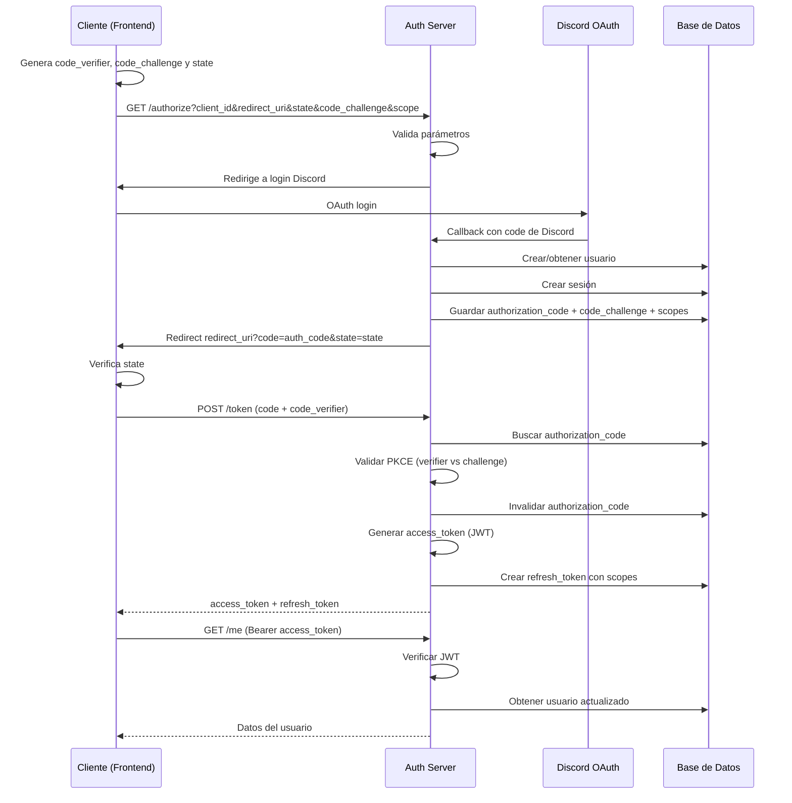

# OAuth 2.0 y Autenticación

## Qué resuelve este módulo

El sistema OAuth 2.0 con PKCE permite autenticación segura de aplicaciones terceras y usuarios finales sin exponer credenciales. Implementa el flujo de autorización estándar de OAuth 2.0 con Code Exchange + PKCE para proteger contra ataques.

## Componentes principales

### 1. Tablas de base de datos

#### `users`

Tabla centralizada de usuarios del sistema (unifica datos de Discord y Minecraft).

```prisma
model User {
  id                String   @id @default(cuid())
  rank              String?  // Rango actual del usuario en Minecraft
  mc_player_uuid    String?  @unique
  discord_user_id   String?  @unique
  created_at        DateTime @default(now())
  updated_at        DateTime @updatedAt
}
```

#### `clients`

Registro de aplicaciones OAuth autorizadas a acceder al sistema.

```prisma
model OAuthClient {
  id             String   @id @default(cuid())
  client_secret  String   @unique
  redirect_uris  String[] // URIs permitidas para redirección post-auth
  scopes         String[] // Scopes que la aplicación puede solicitar
  created_at     DateTime @default(now())
  updated_at     DateTime @updatedAt
}
```

#### `authorization_codes`

Códigos de autorización temporales (válidos 10 minutos) usados en el flujo OAuth.

```prisma
model AuthorizationCode {
  id              String   @id @default(cuid())
  code            String   @unique
  user_id         String
  client_id       String
  redirect_uri    String
  code_challenge  String   // PKCE: hash del code_verifier
  expires_at      DateTime
  scope           String   // Scopes concedidos, separados por espacio
  created_at      DateTime @default(now())
}
```

#### `sessions`

Sesiones activas con refresh tokens para mantener acceso sin re-autenticar.

```prisma
model Session {
  id             String   @id @default(cuid())
  user_id        String
  refresh_token  String   @unique
  client_id      String
  scope          String   // Scopes de la sesión, separados por espacio
  expires_at     DateTime
  created_at     DateTime @default(now())
}
```

### 2. Flujo de autorización (OAuth 2.0 + PKCE)



## Scopes disponibles

Los scopes se solicitan en `GET /auth/authorize` usando el parámetro `scope` con valores separados por espacio. El servidor valida que todos los scopes pedidos existan y estén permitidos por `Client.scopes`.

| Scope       | Qué habilita en `/auth/me`                                                                                            |
| ----------- | --------------------------------------------------------------------------------------------------------------------- |
| `openid`    | Claims de identidad del access token: `sub`, `iss`, `aud`, `exp`.                                                     |
| `identify`  | Información general del usuario del sistema: `id`, `rank`, `created_at` y `discord_user`.                             |
| `minecraft` | Información del jugador vinculado: `mc_player` con `digs`, `nickname`, `uuid`, `rank`, `user_id`, `medias` y `roles`. |

Ejemplo:

```http
GET /auth/authorize?response_type=code&client_id=api-panel&redirect_uri=https%3A%2F%2Fapp.example.com%2Fcallback&code_challenge=...&code_challenge_method=S256&scope=openid%20identify%20minecraft
```

Si no se solicita ningún scope, el token no obtiene permisos para leer datos en `/auth/me`.

## Endpoints

### `GET /auth/authorize`

**Propósito:** Iniciar flujo de autorización y presentar consentimiento.

**Parámetros query:**

- `client_id` (requerido): ID de la aplicación
- `redirect_uri` (requerido): URI de redirección post-autorización
- `response_type` (requerido): debe ser `"code"`
- `code_challenge` (requerido): SHA256 del code_verifier (PKCE)
- `code_challenge_method` (requerido): debe ser `"S256"`
- `scope` (opcional): lista de scopes separados por espacio (`openid`, `identify`, `minecraft`)
- `state` (recomendado): nonce para evitar CSRF

**Respuesta:**

- Página HTML con formulario de consentimiento
- Botón "Autorizar" redirige a POST con code

**Respuesta:**

- Redirección a `redirect_uri?code=...&state=...`
- Code válido por 5 minutos

### `POST /auth/token`

**Propósito:** Intercambiar authorization_code por access_token y refresh_token.

**Body:**

```json
{
    "grant_type": "authorization_code",
    "code": "...",
    "code_verifier": "original_verifier",
    "client_id": "xxx",
    "redirect_uri": "https://app.example.com/callback"
}
```

**Respuesta:**

```json
{
    "access_token": "eyJ...",
    "token_type": "Bearer",
    "expires_in": 86400,
    "refresh_token": "ref_..."
}
```

El `access_token` es un JWT firmado que incluye `sub`, `iss`, `aud`, `exp`, `session_id`, `client_id` y `scope`.

### `POST /auth/refresh`

**Propósito:** Renovar access_token usando refresh_token.

**Body:**

- `refresh_token` (requerido): refresh token de sesión anterior
- `client_id` (requerido): ID de la aplicación
- `grant_type` (requerido): debe ser `"refresh_token"`
- `redirect_uri` (requerido): URI usada por el cliente

**Respuesta:**

```json
{
    "access_token": "eyJ...",
    "token_type": "Bearer",
    "expires_in": 86400,
    "refresh_token": "ref_...",
    "scope": "openid identify minecraft"
}
```

### `POST /auth/me`

**Propósito:** Obtener información del usuario autenticado.

**Headers:**

- `Authorization: Bearer <access_token>`

**Respuesta con `openid`:**

```json
{
    "sub": "123456789",
    "iss": "https://api.example.com",
    "aud": "api-panel",
    "exp": 1234567890
}
```

**Respuesta con `identify`:**

```json
{
    "id": "123",
    "rank": "Admin",
    "created_at": 1780000000000,
    "discord_user": {
        "id": "123",
        "username": "user_123"
    }
}
```

**Respuesta con `minecraft`:**

```json
{
    "mc_player": {
        "digs": 123,
        "nickname": "user123",
        "uuid": "00000000-0000-0000-0000-000000000000",
        "rank": "Miembro",
        "user_id": "123",
        "medias": [{ "type": "youtube", "url": "https://..." }],
        "roles": ["Builder", "Streamer"]
    }
}
```

Cuando se combinan scopes, `/auth/me` combina las secciones correspondientes en el mismo objeto JSON.

### `GET /oauth/minecraft`

Inicia el OAuth de Microsoft para vincular la cuenta de Minecraft con el
usuario Triskcraft autenticado.

**Requisitos:**

- Sesión OAuth mediante cookie o `Authorization: Bearer <access_token>`
- Scope `minecraft`
- La sesión OAuth debe estar activa cuando se usa un access token

La ruta genera `state` y PKCE, guarda el contexto cifrado en una cookie
HTTP-only y redirige al inicio de sesión de Microsoft. Microsoft debe tener
registrada la URI `${API_URL}/oauth/minecraft/callback`.

### `GET /oauth/minecraft/callback`

Recibe el código de Microsoft y ejecuta el flujo:

1. Microsoft OAuth
2. Xbox Live
3. Xbox Secure Token Service
4. Minecraft Services
5. Consulta de `/minecraft/profile`
6. Creación o actualización de `Player`
7. Vinculación de `User.mc_player_uuid`

La ruta no acepta nicknames ni UUID enviados por el cliente. El perfil se
obtiene directamente desde Minecraft Services y se rechazan asociaciones que
pertenezcan a otro usuario de Discord.

**Respuesta:**

```json
{
    "linked": true,
    "mc_player": {
        "nickname": "Steve",
        "uuid": "8667ba71b85a4004af54457a9734eed7"
    }
}
```

### `GET /auth/discord`

**Propósito:** Callback de autenticación con Discord OAuth integrada.

> Revisar documentación en https://docs.discord.com/developers/topics/oauth2

## Seguridad

### PKCE (Proof Key for Public Clients)

- Cliente genera `code_verifier` aleatorio (43-128 caracteres)
- Calcula `code_challenge = SHA256(base64url(code_verifier))`
- Envía `code_challenge` en la solicitud inicial
- En el intercambio de token, envía `code_verifier`
- Servidor valida que `SHA256(code_verifier) == code_challenge`

**Por qué:** protege contra autorización codes interceptados en URLs de redirección o historiadas de navegador.

### Validaciones

1. **State parameter:** previene ataques CSRF
2. **Redirect URI whitelist:** solo acepta URIs registradas
3. **Code expiration:** codes válidos 5 minutos
4. **JWT firma:** access tokens firmados con clave privada en el servidor
5. **Scopes por cliente:** cada scope solicitado debe existir y estar permitido para el `Client`
6. **Refresh token rotation:** cada refresh exitoso emite un nuevo refresh token y reemplaza el hash anterior

### Almacenamiento de secretos

- `Session.refresh_token` es único, hasheado e indexado para revocación rápida
- `AuthorizationCode.code` se valida en BD

## Flujo de vinculación Discord + Minecraft

Con el nuevo sistema OAuth, la vinculación funciona así:

1. Usuario accede a webapp externa
2. Hace clic "iniciar sesion"
3. Se redirige a `/auth/authorize?client_id=xxx&...`
4. Confirma y recibe `code`
5. Cliente intercambia por `access_token`
6. Con el token, puede acceder a `/auth/me` para obtener su usuario según scopes
7. El usuario queda creado/actualizado en tabla `users`

## Integración con Discord

Cuando un usuario se autentica vía OAuth:

1. Se extrae `discord_user_id` de claims
2. Se crea o actualiza registro en tabla `users`
3. Se enlaza con `DiscordUser` existente si existe
4. Se crea `Session` con refresh token

## Estado del desarrollo

✅ Tablas y migraciones completadas  
✅ Endpoints OAuth implementados  
✅ Scopes `openid`, `identify` y `minecraft` implementados
⏳ UI de consentimiento (desarrollo en progreso)
✅ Refresh token rotation

> Vease https://github.com/Triskcraft/triskcraft-bot/issues/41
