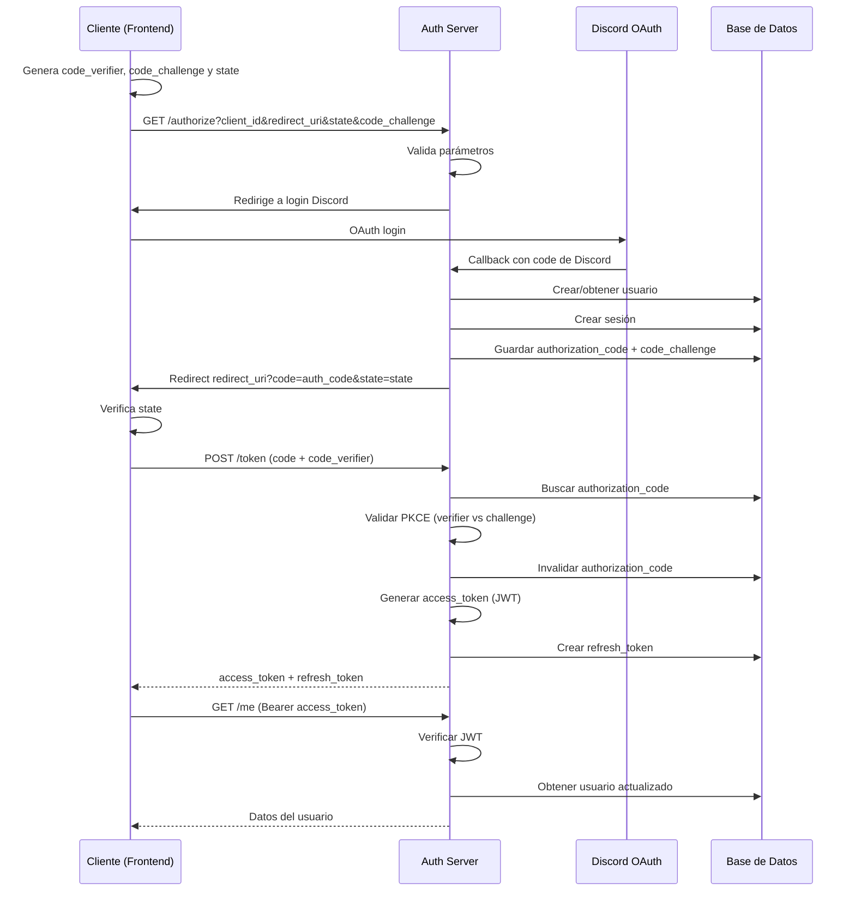

# OAuth 2.0 y Autenticación

## Qué resuelve este módulo

El sistema OAuth 2.0 con PKCE permite autenticación segura de aplicaciones terceras y usuarios finales sin exponer credenciales. Implementa el flujo de autorización estándar de OAuth 2.0 con Code Exchange + PKCE para proteger contra ataques.

## Componentes principales

### 1. Tablas de base de datos

#### `users`

Tabla centralizada de usuarios del sistema (unifica datos de Discord y Minecraft).

```prisma
model User {
  id                String   @id @default(cuid())
  rank              String?  // Rango actual del usuario en Minecraft
  mc_player_uuid    String?  @unique
  discord_user_id   String?  @unique
  created_at        DateTime @default(now())
  updated_at        DateTime @updatedAt
}
```

#### `clients`

Registro de aplicaciones OAuth autorizadas a acceder al sistema.

```prisma
model OAuthClient {
  id             String   @id @default(cuid())
  client_secret  String   @unique
  redirect_uris  String[] // URIs permitidas para redirección post-auth
  created_at     DateTime @default(now())
  updated_at     DateTime @updatedAt
}
```

#### `authorization_codes`

Códigos de autorización temporales (válidos 10 minutos) usados en el flujo OAuth.

```prisma
model AuthorizationCode {
  id              String   @id @default(cuid())
  code            String   @unique
  user_id         String
  client_id       String
  redirect_uri    String
  code_challenge  String   // PKCE: hash del code_verifier
  expires_at      DateTime
  created_at      DateTime @default(now())
}
```

#### `sessions`

Sesiones activas con refresh tokens para mantener acceso sin re-autenticar.

```prisma
model Session {
  id             String   @id @default(cuid())
  user_id        String
  refresh_token  String   @unique
  client_id      String
  expires_at     DateTime
  created_at     DateTime @default(now())
}
```

### 2. Flujo de autorización (OAuth 2.0 + PKCE)



## Endpoints

### `GET /auth/oauth/authorize`

**Propósito:** Iniciar flujo de autorización y presentar consentimiento.

**Parámetros query:**

- `client_id` (requerido): ID de la aplicación
- `redirect_uri` (requerido): URI de redirección post-autorización
- `response_type` (requerido): debe ser `"code"`
- `code_challenge` (requerido): SHA256 del code_verifier (PKCE)
- `code_challenge_method` (requerido): debe ser `"S256"`
- `state` (recomendado): nonce para evitar CSRF

**Respuesta:**

- Página HTML con formulario de consentimiento
- Botón "Autorizar" redirige a POST con code

**Respuesta:**

- Redirección a `redirect_uri?code=...&state=...`
- Code válido por 10 minutos

### `POST /auth/oauth/token`

**Propósito:** Intercambiar authorization_code por access_token y refresh_token.

**Body:**

```json
{
    "grant_type": "authorization_code",
    "code": "...",
    "code_verifier": "original_verifier",
    "client_id": "xxx",
    "redirect_uri": "https://app.example.com/callback"
}
```

**Respuesta:**

```json
{
    "access_token": "eyJ...",
    "token_type": "Bearer",
    "expires_in": 3600,
    "refresh_token": "ref_...",
    "scope": "openid profile email"
}
```

### `GET /auth/oauth/refresh`

**Propósito:** Renovar access_token usando refresh_token.

**Parámetros query:**

- `refresh_token` (requerido): refresh token de sesión anterior
- `client_id` (requerido): ID de la aplicación

**Respuesta:**

```json
{
    "access_token": "eyJ...",
    "token_type": "Bearer",
    "expires_in": 3600,
    "refresh_token": "ref_..."
}
```

### `GET /auth/oauth/me`

**Propósito:** Obtener información del usuario autenticado.

**Headers:**

- `Authorization: Bearer <access_token>`

**Respuesta:**

```json
{
  "id": "123",
  "rank": "Admin",
  "created_at": "2026-04-30T10:00:00Z",
  "discord_user": {
    "id": "123",
    "username: "user_123"
  },
  "mc_player": {
    "uuid": "123",
    "nickname": "user123"
  }
}
```

### `GET /auth/oauth/discord`

**Propósito:** Callback de autenticación con Discord OAuth integrada.

> Revisar documentación en https://docs.discord.com/developers/topics/oauth2

## Seguridad

### PKCE (Proof Key for Public Clients)

- Cliente genera `code_verifier` aleatorio (43-128 caracteres)
- Calcula `code_challenge = SHA256(base64url(code_verifier))`
- Envía `code_challenge` en la solicitud inicial
- En el intercambio de token, envía `code_verifier`
- Servidor valida que `SHA256(code_verifier) == code_challenge`

**Por qué:** protege contra autorización codes interceptados en URLs de redirección o historiadas de navegador.

### Validaciones

1. **State parameter:** previene ataques CSRF
2. **Redirect URI whitelist:** solo acepta URIs registradas
3. **Code expiration:** codes válidos 5 minutos
4. **JWT firma:** access tokens firmados con clave privada en el servidor
5. **Refresh token rotation (futuro):** revocar refresh tokens antiguos

### Almacenamiento de secretos

- `Session.refresh_token` es único, hasheado e indexado para revocación rápida
- `AuthorizationCode.code` se valida en BD

## Flujo de vinculación Discord + Minecraft

Con el nuevo sistema OAuth, la vinculación funciona así:

1. Usuario accede a webapp externa
2. Hace clic "iniciar sesion"
3. Se redirige a `/auth/oauth/authorize?client_id=xxx&...`
4. Confirma y recibe `code`
5. Cliente intercambia por `access_token`
6. Con el token, puede acceder a `/v1/users/me` para obtener su usuario
7. El usuario queda creado/actualizado en tabla `users`

## Integración con Discord

Cuando un usuario se autentica vía OAuth:

1. Se extrae `discord_user_id` de claims
2. Se crea o actualiza registro en tabla `users`
3. Se enlaza con `DiscordUser` existente si existe
4. Se crea `Session` con refresh token

## Estado del desarrollo

✅ Tablas y migraciones completadas  
✅ Endpoints OAuth implementados  
⏳ UI de consentimiento (desarrollo en progreso)
⏳ Refresh token rotation (futuro)

> Vease https://github.com/Triskcraft/triskcraft-bot/issues/41
